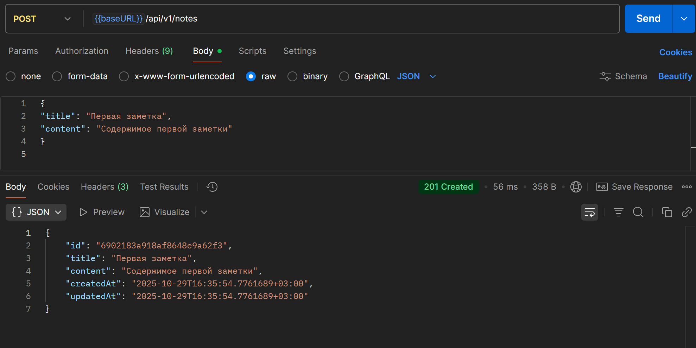
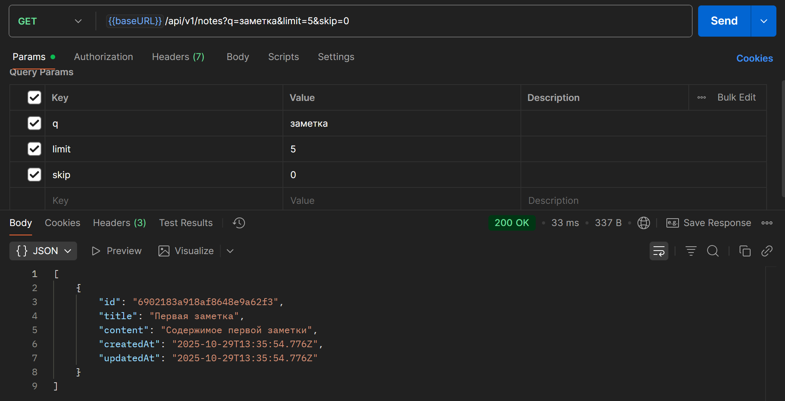
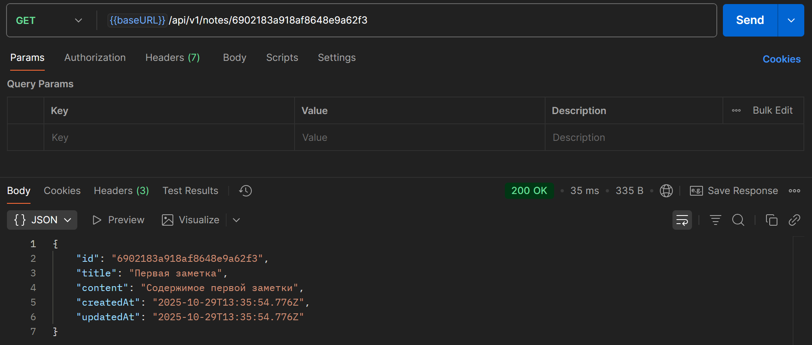
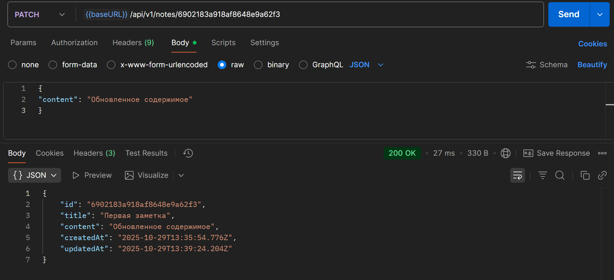
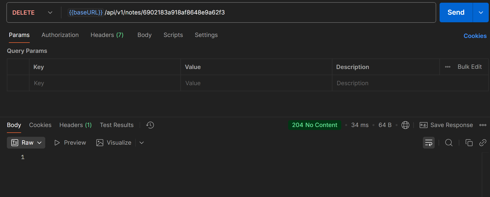
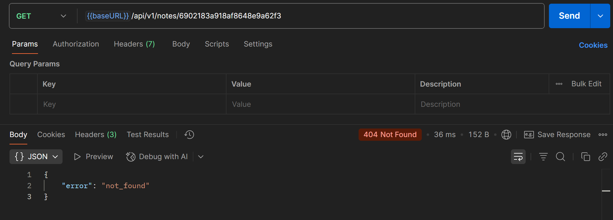

# Отчет по практическому занятию №8
## Работа с MongoDB: подключение, создание коллекции, CRUD-операции

### Выполнил: Туев Д.
### Группа: ЭФМО-01-25

## Цели занятия
- Понять базовые принципы документной БД MongoDB (документ, коллекция, BSON, ObjectID)
- Научиться подключаться к MongoDB из Go с использованием официального драйвера
- Создать коллекцию, индексы и реализовать CRUD для одной сущности (notes)
- Отработать фильтрацию, пагинацию, обновления, удаление и обработку ошибок

## Описание окружения

**Версия Go:** 1.25.1

**Версия MongoDB:** 7.0

**Драйвер MongoDB для Go:** go.mongodb.org/mongo-driver v1.17.6

## Установка и настройка MongoDB

MongoDB был запущен в Docker-контейнере на удаленном сервере


## Настройка переменных окружения

Для работы приложения требуются следующие переменные окружения:

- MONGO_URI - строка подключения к MongoDB

- MONGO_DB - название базы данных

- HTTP_ADDR - адрес HTTP сервера

Структура проекта
```bash

pz8-mongo/
├── cmd/
│   └── api/
│       └── main.go
├── internal/
│   ├── db/
│   │   └── mongo.go
│   └── notes/
│       ├── model.go
│       ├── repo.go
│       ├── handler.go
│       └── repo_test.go
├── docker-compose.yml
├── .env.example
├── go.mod
└── go.sum
```
## Реализованный функционал
### Модель данных
```go

type Note struct {
    ID        primitive.ObjectID `bson:"_id,omitempty" json:"id"`
    Title     string             `bson:"title"         json:"title"`
    Content   string             `bson:"content"       json:"content"`
    CreatedAt time.Time          `bson:"createdAt"     json:"createdAt"`
    UpdatedAt time.Time          `bson:"updatedAt"     json:"updatedAt"`
}
```

### HTTP endpoints:

- POST /api/v1/notes - создание новой заметки
- GET /api/v1/notes - получение списка заметок с пагинацией и поиском
- GET /api/v1/notes/{id} - получение заметки по ID
- PATCH /api/v1/notes/{id} - частичное обновление заметки
- DELETE /api/v1/notes/{id} - удаление заметки
- GET /health - проверка здоровья приложения

## Результаты тестирования

Для тестирования была сформирована [Postman коллекция](https://lively-flare-564043.postman.co/workspace/My-Workspace~fe2081e8-b325-4776-8b48-400d41f5b4bd/collection/42992055-dbd147c9-cdd6-4e90-ab1b-54ad26d13849?action=share&creator=42992055)

### Создание новой заметки



### Получение списка заметок



### Получение заметки по ID



### Частичное обновление заметки



### Удаление заметки





## Что такое MongoDB и зачем нужны документные БД

MongoDB - это документно-ориентированная NoSQL база данных, которая хранит данные в формате BSON (Binary JSON). В отличие от реляционных баз данных, MongoDB не требует строгой схемы и позволяет хранить документы с разной структурой в одной коллекции.
### Преимущества MongoDB:

- Гибкая схема данных

- Высокая производительность при операциях вставки и чтения

- Масштабируемость через шардирование

- Удобство работы с вложенными структурами данных

### Основные понятия:

- Документ - аналог строки в SQL, но в формате JSON

- Коллекция - аналог таблицы в SQL

- ObjectID - уникальный идентификатор документа

## Контрольные вопросы
### 1. Чем документная модель MongoDB принципиально отличается от реляционной? Когда она удобнее?

MongoDB использует гибкую документную модель вместо строгих таблиц. Удобнее когда:

- Структура данных часто меняется

- Нужно хранить вложенные объекты

- Требуется высокая скорость вставки

- Данные имеют разную структуру

### 2. Что такое ObjectID и зачем нужен _id? Как корректно парсить/валидировать его в Go?

ObjectID - уникальный идентификатор документа, содержащий временную метку, случайное значение и счетчик. В Go парсится с помощью primitive.ObjectIDFromHex(), валидируется проверкой ошибки.
### 3. Какие операции CRUD предоставляет драйвер MongoDB и какие операторы обновления вы знаете?

- Create: InsertOne, InsertMany

- Read: FindOne, Find

- Update: UpdateOne, UpdateMany с операторами `$set`, `$inc`, `$push`

- Delete: DeleteOne, DeleteMany

### 4. Как устроены индексы в MongoDB? Как создать уникальный индекс и чем он грозит при вставке?

Индексы ускоряют поиск по полям. Уникальный индекс создается командой:
```go

db.Collection("notes").Indexes().CreateOne(ctx, mongo.IndexModel{
    Keys:    bson.D{{Key: "title", Value: 1}},
    Options: options.Index().SetUnique(true),
})
```
При вставке дубликата возникает ошибка "duplicate key error".
### 5. Почему важно использовать context.WithTimeout при вызовах к базе? Что произойдет при его срабатывании?

Context.WithTimeout предотвращает зависание при сетевых проблемах. При срабатывании таймаута операция прерывается и возвращается ошибка context deadline exceeded.
## Выводы

В ходе практической работы был успешно реализован REST-сервис для работы с заметками на Go с использованием MongoDB. Настроено подключение к базе данных, создана коллекция с уникальным индексом, реализованы все CRUD-операции с поддержкой пагинации и поиска. MongoDB продемонстрировала удобство работы с документной моделью данных и гибкость при изменении структуры хранимой информации.